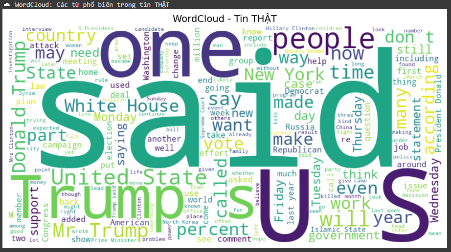
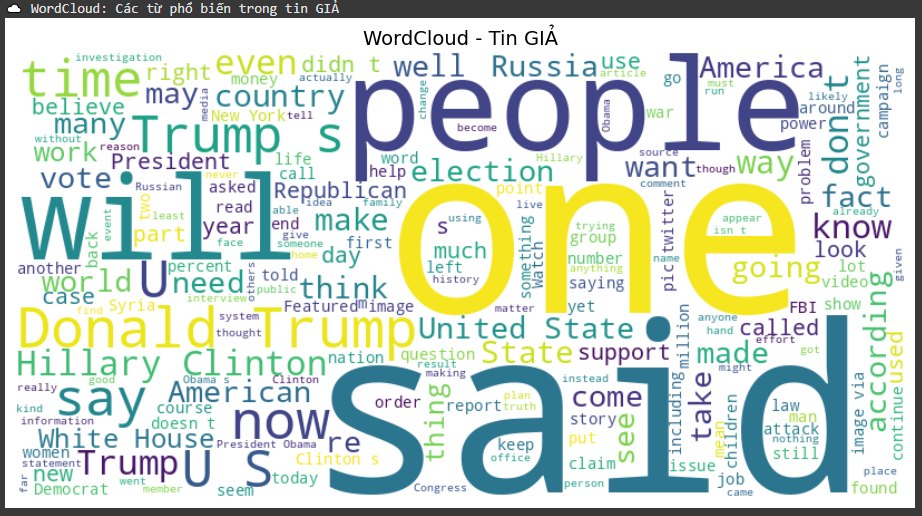
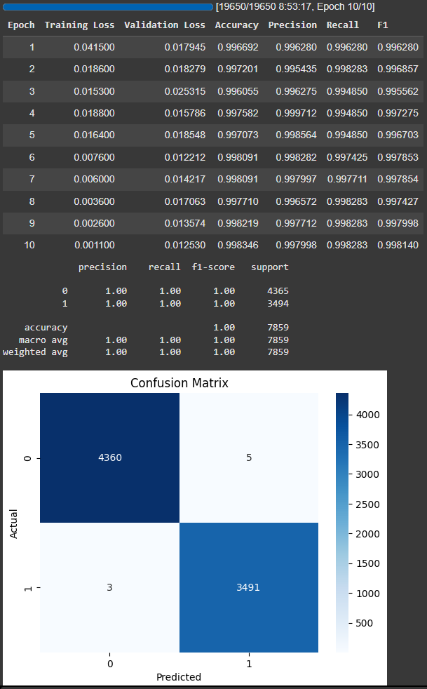
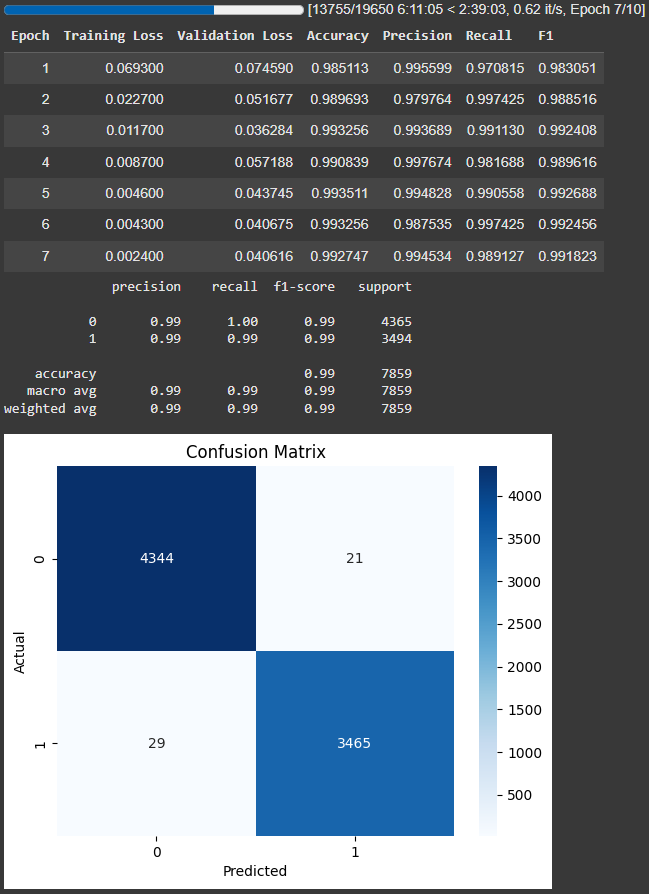
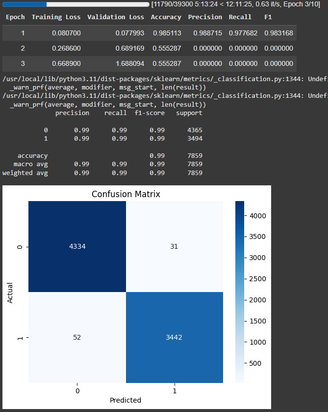

# 🕵️‍♂️ Project Phát hiện Tin tức Giả mạo bằng các mô hình Transformer

Dự án này tập trung vào việc xây dựng và đánh giá một pipeline hoàn chỉnh để phát hiện tin tức giả mạo (Fake News Detection) bằng cách sử dụng các kiến trúc Transformer. Ba mô hình Transformer tiêu biểu đã được lựa chọn để so sánh hiệu suất: **BERT**, **RoBERTa**, và **XLNet**.

---

## 🚀 Tổng quan

Trong bối cảnh tin giả ngày càng lan rộng, việc xây dựng các hệ thống tự động để xác minh tính xác thực của thông tin là vô cùng cần thiết. Đồ án này tiếp cận bài toán bằng cách ứng dụng sức mạnh của các mô hình ngôn ngữ lớn (Large Language Models), cụ thể là các kiến trúc Transformer.

Hệ thống được thiết kế theo hướng module hóa, bao gồm đầy đủ các giai đoạn của một dự án Khoa học Dữ liệu:
1.  **Tải và khám phá dữ liệu (EDA)**
2.  **Tiền xử lý và làm sạch dữ liệu**
3.  **Tokenization và chuẩn bị dữ liệu**
4.  **Huấn luyện và tinh chỉnh (Fine-tuning) mô hình**
5.  **Đánh giá hiệu suất và so sánh**
6.  **Dự đoán trên dữ liệu mới (Inference)**

## 🎯 Mục tiêu

*   Xây dựng một pipeline NLP hoàn chỉnh, có khả năng tái sử dụng và mở rộng.
*   Ứng dụng và so sánh hiệu suất của ba mô hình Transformer phổ biến (BERT, RoBERTa, XLNet).
*   Đánh giá toàn diện các mô hình dựa trên các chỉ số tiêu chuẩn (Accuracy, Precision, Recall, F1-score).
*   Cung cấp một hệ thống có khả năng dự đoán nhãn (Thật/Giả) cho một văn bản tin tức mới.

## 📊 Dữ liệu và Phân tích Khám phá (EDA)

*   **Nguồn dữ liệu**: Bộ dữ liệu được lấy từ Kaggle: [Fake News Dataset](https://www.kaggle.com/datasets/basdong/fake-news-dataset).
*   **Kích thước**: ~78,617 mẫu tin tức.
*   **Phân phối nhãn**: Dữ liệu khá cân bằng (44.5% tin thật, 55.5% tin giả), là điều kiện lý tưởng để huấn luyện mô hình.

#### Phân tích từ khóa nổi bật

Phân tích Word Cloud và N-grams cho thấy sự khác biệt rõ rệt giữa hai loại tin:
*   **Tin giả**: Thường tập trung vào các chủ đề chính trị gây tranh cãi và các nhân vật nổi tiếng như "Trump", "Clinton", "Obama".
*   **Tin thật**: Sử dụng ngôn ngữ chính thống, mang tính thể chế hơn như "government", "state", "Republican".

| Word Cloud Tin Thật | Word Cloud Tin Giả |
| :---: | :---: |
|  |  |

---

## ⚙️ Thiết kế Pipeline

Hệ thống được xây dựng dựa trên các lớp (class) Python độc lập, giúp mã nguồn trở nên rõ ràng và dễ bảo trì:

| Lớp (Class) | Chức năng |
| :--- | :--- |
| `KagleDataLoader` | Tải và hợp nhất dữ liệu từ KaggleHub. |
| `EDAVisualizer` | Phân tích và trực quan hóa dữ liệu. |
| `DataPreprocessor` | Làm sạch và chuẩn hóa dữ liệu văn bản. |
| `TextDatasetBuilder` | Tokenize và tạo `DatasetDict` cho Hugging Face. |
| `ModelBuilder` | Tải và cấu hình mô hình Transformer. |
| `ModelTrainer` | Đóng gói và thực hiện quá trình huấn luyện bằng `Trainer` API. |
| `ModelEvaluator` | Đánh giá mô hình trên tập kiểm thử. |
| `FakeNewsPipelineManager` | Điều phối toàn bộ luồng công việc. |

## 📈 Kết quả Huấn luyện và Đánh giá

Các mô hình được huấn luyện với các siêu tham số tối ưu, bao gồm cả kỹ thuật **Mixed-Precision (FP16)** để tăng tốc và **Early Stopping** để chống overfitting.

#### Bảng tổng hợp hiệu suất

| Mô hình | Accuracy | Precision | Recall | F1-Score |
| :--- | :---: | :---: | :---: | :---: |
| ✅ **RoBERTa (roberta-base)** | 99.83% | 99.80% | 99.83% | **99.81%** |
| **BERT (bert-base-uncased)** | 99.35% | 99.45% | 99.13% | **99.18%** |
| **XLNet (xlnet-base-cased)** | 98.51% | 98.87% | 97.77% | **98.32%** |

#### Ma trận nhầm lẫn (Confusion Matrix)

| RoBERTa | BERT | XLNet |
| :---: | :---: | :---: |
|  |  |  |

**Thảo luận kết quả:**
*   **RoBERTa** là mô hình có hiệu suất vượt trội nhất, cho thấy khả năng nắm bắt ngữ cảnh sâu sắc và phân biệt các sắc thái ngôn ngữ tinh vi.
*   **BERT** cũng thể hiện sức mạnh ấn tượng và là một lựa chọn cân bằng giữa hiệu suất và tài nguyên tính toán.
*   **XLNet** cho kết quả tốt ở epoch đầu tiên nhưng nhanh chóng bị overfitting, cho thấy mô hình này cần các kỹ thuật điều chuẩn mạnh hơn trên bộ dữ liệu này.

## 🔮 Kết quả Dự đoán trên Dữ liệu Mới

Hệ thống được thử nghiệm với một số tiêu đề tin tức giật gân và đã đưa ra dự đoán chính xác:

| Tiêu đề Tin tức | Nhãn Dự đoán |
| :--- | :---: |
| "NASA confirms presence of microbial life on Europa." | **FAKE** |
| "Bill Gates to implant tracking chips via vaccines, claims viral post." | **FAKE** |
| "Biden signs executive order on AI regulation." | **FAKE** |
| "Apple releases new iPhone model with brainwave control." | **FAKE**|
| "WHO warns of new COVID variant emerging in Southeast Asia." | **FAKE** |

Kết quả này cho thấy các mô hình đã học được các đặc trưng cốt lõi của tin giả và có khả năng tổng quát hóa tốt.

## 💡 Kết luận và Hướng phát triển

*   **Kết luận**: Đồ án đã xây dựng thành công một pipeline NLP hiệu quả. **RoBERTa** được xác định là mô hình tốt nhất cho bài toán này, trong khi **BERT** là một lựa chọn thay thế thực tế và mạnh mẽ.
*   **Hướng phát triển**:
    *   **Mở rộng mô hình**: Thử nghiệm với các mô hình lớn hơn và tiên tiến hơn (`DeBERTa`, `Longformer`).
    *   **Cải thiện dữ liệu**: Tăng cường dữ liệu đa dạng hơn và mở rộng sang các ngôn ngữ khác (ví dụ: tiếng Việt).
    *   **Triển khai**: Tối ưu hóa mô hình (quantization, pruning) và triển khai dưới dạng một ứng dụng web/API.
    *   **Tăng tính giải thích**: Sử dụng các công cụ như LIME/SHAP để giải thích lý do tại sao một tin tức được phân loại là thật/giả.

---

## 🔧 Cách chạy Project

1.  **Clone repository này về máy của bạn.**
2.  **Cài đặt các thư viện cần thiết:**
    ```bash
    pip install -r requirements.txt
    ```
3.  **Chuẩn bị API Keys:**
    Để theo dõi quá trình huấn luyện, bạn cần có tài khoản [Hugging Face](https://huggingface.co/) và [Weights & Biases](https://wandb.ai/). Sau đó, thiết lập các biến môi trường sau:
    ```bash
    export HUGGINGFACE_TOKEN='your_hf_token'
    export WANDB_API_KEY='your_wandb_key'
    ```
4.  **Chạy Notebook:**
    Mở và chạy file `Báo-cáo-NLP.ipynb` trong môi trường Jupyter hoặc Google Colab (khuyến khích sử dụng GPU để tăng tốc độ huấn luyện).
